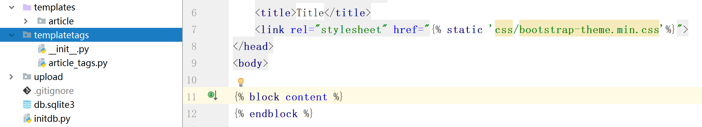
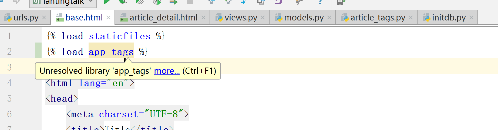

# 自定义template-tag
在模板文件中  引用的为模板标签，{{}}引用的为模板变量。模板标签本质上是一个Python函数，其定义步骤为

1. 创建文件

    在project目录下新建templatetags目录，并新建一个空文件__init__.py(文件名必须是这个),表示这是一个python Module，然后新建一个app_tags.py(文件可以自定义)
    
2. 在app_tags.py中配置如下
    ```python
    from django import template
    from app_article.models import Article

    register = template.Library()

    @register.simple_tag
    def get_recent_article(num=5):
        return Article.objects.all().order_by('-created_time')[:num]=
    ```
3. 在模板文件中引用
在模板顶部 ``
,然后就可以模板中引用其中的的标签函数了。

# 查看QuerySet执行对应的sql语句
- 方法一：>>>Article.objects.all().query.__str__()
- 方法二：
```python
from django.db import Connection


```
